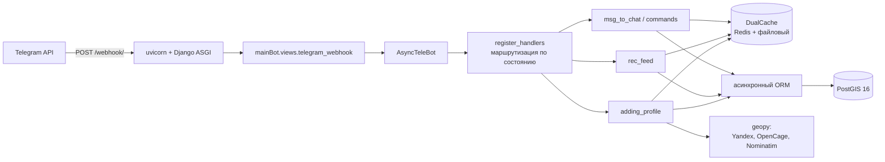

# Бот-каталог Telegram-каналов

Бот собирает анкеты каналов и показывает их людям по интересам и геолокации. Владелец канала заполняет анкету прямо в боте: фото, описание, город, хэштеги. Пользователь листает ленту подборок, ставит лайк и по лайку получает ссылку на канал. Обновления от Telegram приходят вебхуком, Django работает в асинхронном режиме, гео-фильтр построен на PostGIS.

## Зачем это

В Telegram нет каталога каналов с фильтром «мой город + мои темы». Есть каталоги с накрученными подписчиками и есть чаты «посоветуйте канал». Владельцу небольшого канала попасть в подборку тяжело: он либо покупает рекламу у крупных, либо сидит без аудитории.

Бот закрывает обе стороны. Владелец заполняет анкету и получает показы, пользователь подписывается только на то, что ему зашло. Выдача зависит от категорий, которые человек выбрал, и от расстояния до его города, чтобы в ленте не всплывали каналы из другого региона.

Проект учебный. Запуск доведён до рабочего состояния: стек поднимается, миграции применяются, админка и вебхук-эндпоинт отвечают. Лента рекомендаций при этом содержит непочиненный участок, автотестов нет. Подробности в разделе «Ограничения»: его стоит прочитать до того, как пробовать бота.

## Возможности

### Анкета канала

Добавить канал можно двумя способами. Первый способ: взять из профиля. Если канал закреплён как личный канал владельца, бот сам подтянет аватарку, описание и число подписчиков. Второй способ: по ссылке или `@username`, и тогда бот проверит через `get_chat_administrators`, что человек действительно админ этого канала. Так отсеиваются анкеты на чужие каналы.

Фотографий до четырёх, они переключаются кнопками под сообщением: номер фото лежит в `callback_data`, а id канала закодирован в base62 (число записано буквами и цифрами), чтобы его нельзя было прочитать из кнопки. Если у канала нет аватарки, бот рисует заглушку через Pillow. Категории выбираются из списка с пагинацией по пять штук: три тега бесплатно, семь с премиумом. Гео: либо локация из Telegram, либо название города текстом.

### Лента

Десять позиций за раз: 70% из категорий пользователя, 30% случайных каналов, всё перемешано. Очередь подборки живёт в кэше час. Если у пользователя указан город, в выдачу попадают каналы его региона или в радиусе 50 км (`location__distance_lte` по geography-полю). Дизлайк пролистывает дальше, лайк открывает кнопку со ссылкой на канал.

Это логика, которая написана в коде. На живом запросе построение подборки падает. Почему именно, описано в «Ограничениях».

### Обратная связь и модерация

Комментарий до 512 символов, жалоба с выбором категории и подтверждением. И то и другое попадает в админку с флагом «просмотрено». Название и описание анкеты прогоняются через список запрещённых слов (`ban_words.json`) и регулярное выражение на ссылки: ссылка в описании канала запрещена, потому что уводит трафик мимо бота. Забаненный пользователь отсекается по кэшу и до базы не доходит.

### Рефералка, премиум, статистика

У каждого пользователя свой код в диплинке `/start`, приведённые считаются в `ref_people`. Премиум расширяет лимит категорий. Админка зарегистрирована по всем моделям: анкеты, каналы, жалобы с фильтром, комментарии, статистика уникальных пользователей по дням.

## Стек

| Слой | Технологии |
|---|---|
| Язык и фреймворк | Python 3.12, Django 5.1.1, ASGI (`uvicorn`, асинхронный интерфейс приложения и веб-сервера), асинхронный ORM (объектно-реляционное отображение; `acreate`, `aset`, `async for`) |
| База данных | Postgres 16 + PostGIS 3.5, GeoDjango (`django.contrib.gis`) |
| Кэш | Redis (клиент `redis==5.1.1`) и файловый кэш, поверх них свой двухуровневый бэкенд |
| Бот | pyTelegramBotAPI 4.23 (`AsyncTeleBot`), режим вебхука |
| Геокодирование | `geopy` 2.4.1: Яндекс, OpenCage, Nominatim |
| Разное | Pillow (заглушка-аватар), `aiohttp`, `python-dotenv`, Celery и `aio-pika` (каркас, в compose выключен) |
| Инфраструктура | Docker, docker-compose: Postgres/PostGIS, Redis, приложение |

## Как это устроено



Обновление приходит на `/webhook/`, Django отдаёт его `AsyncTeleBot`, дальше работают два обработчика: на сообщения и на нажатия кнопок. Выбор обработчика идёт по состоянию из кэша (`user_state:{id}` со временем жизни 25 минут), поэтому «Отмена» доступна на любом шаге заполнения анкеты, а не только на последнем. Библиотеку конечных автоматов (FSM) я не брал: на этих шагах состояние живёт одной строкой в Redis и `if` в обработчике. Если шагов станет заметно больше или внутри шага появятся ветвления, решение придётся менять на полноценный конечный автомат.

Самой содержательной частью проекта стал кэш. В `mainBot/caches/dual_cache.py` лежит собственный бэкенд поверх двух стандартных: Redis как быстрый слой со временем жизни записи в час и файловый кэш как долгий, на три дня. Чтение идёт в Redis, при промахе уходит в файл, и найденное прогревается обратно. Он прописан бэкендом по умолчанию, поэтому остальной код работает через обычный `django.core.cache` и про два уровня не знает.

Геокодирование вынесено в `mainBot/telegram/geo_utils.py`. Провайдеров три, они опрашиваются по очереди: Яндекс, затем OpenCage, затем Nominatim. Формат ответа у каждого свой, под каждый написан отдельный разбор JSON: Яндекс, например, отдаёт город глубоко в `AddressDetails`, а если города нет, приходится брать область. Результат кэшируется, чаще одного запроса в три секунды пользователь не сделает. `geopy` синхронный, поэтому вызовы уходят в `asyncio.to_thread` и не блокируют цикл событий.

## Модели

Восемь моделей, все в `mainBot/models.py`.

| Модель | Что хранит |
|---|---|
| `User` | телеграм-пользователь: регион, координаты (`PointField`, geography), категории, премиум, реферальный код и пригласивший, бан, последняя активность |
| `Channel` | анкета канала: название, описание, `poster` (идентификаторы фотографий в Telegram, через пробел), `external_id`, регион и координаты, категории, счётчики лайков и дизлайков, подписчики, уровень продвижения (`boost`) |
| `СategoryChannel` | хэштег-категория и вес, которым настраивается близость тем |
| `Comment` | комментарий к каналу, до 512 символов |
| `Complaint` | жалоба: кто, на какой канал, по какой категории, просмотрена ли |
| `СategoryComplaint` | категория жалобы |
| `SuperChannel` | спонсорский канал и счётчик приведённых подписчиков |
| `ServiceUsage` | уникальные пользователи по дням |

Связи: у `User` и `Channel` категории связаны многие-ко-многим, у `Channel` владельцы тоже многие-ко-многим, `Comment` и `Complaint` ссылаются на `User` и `Channel`, у `User` есть ссылка на самого себя для пригласившего.

## Запуск

Нужен Docker с запущенным демоном, всё остальное внутри образа. Проверял на macOS (Apple Silicon, `colima`, Docker 29). Если плагин compose не подключён, те же команды работают через `docker-compose`.

```bash
cd tgBot2
cp .env.example .env        # можно и пропустить: без файла поднимутся значения по умолчанию из compose
docker compose up -d --build
```

Первый запуск качает образ `postgis/postgis:16-3.5` размером около 880 МБ и собирает образ приложения с библиотекой GDAL. Это несколько минут, дальше стек стартует за секунды.

Официальный образ PostGIS собран только под процессоры Intel и AMD (amd64), поэтому у сервиса `db` в `docker-compose.yml` стоит `platform: linux/amd64`, и на Apple Silicon Postgres работает через эмуляцию. Если нужна скорость без эмуляции, замените образ на `imresamu/postgis:16-3.5`: это та же сборка, но под arm64 (процессоры Apple Silicon).

### Что должно быть в логах

```bash
docker compose logs bot
```

Сначала двадцать миграций `mainBot` подряд с `OK`, потом `135 static files copied to '/app/static'`, потом `BASE_URL не задан — установка вебхука пропущена` и `Uvicorn running on http://0.0.0.0:8000`. Миграции и `collectstatic` контейнер выполняет сам при старте, руками ничего делать не нужно.

### Как проверить, что работает

```bash
curl http://localhost:8000/webhook/                                      # Hello! I'm working
curl -o /dev/null -w '%{http_code}\n' http://localhost:8000/admin/login/  # 200
```

Админка живёт на `http://localhost:8000/admin/`, суперпользователь создаётся так:

```bash
docker compose exec bot python manage.py createsuperuser
```

### Живой бот

Вебхук требует публичного https-адреса, потому что Telegram не умеет стучаться в localhost. Порядок такой: поднять туннель (`cloudflared tunnel --url http://localhost:8000` или `ngrok http 8000`), полученный адрес положить в `BASE_URL`, вписать в `.env` настоящий `BOT_TOKEN` от `@BotFather` и выполнить `docker compose restart bot`. Команда `webhookstart` увидит адрес и поставит вебхук.

Этого шага в моём прогоне не было: стек проверялся с пустым `BASE_URL`, то есть без обновлений от Telegram. При пустом `BASE_URL` бот не падает, а просто пропускает установку вебхука.

### Остановка

```bash
docker compose down        # контейнеры останавливаются, данные остаются
docker compose down -v     # плюс удаляет volume redis_data
```

Данные Postgres лежат в каталоге `tgBot2/postgres/`, примонтированном с хоста, команда `down` их не трогает.

### Переменные окружения

| Переменная | Зачем |
|---|---|
| `SECRET_KEY` | ключ Django |
| `DEBUG` | `True` для разработки, `False` для продакшена, тогда `ALLOWED_HOSTS` собирается из `BASE_URL` |
| `POSTGRES_DB`, `POSTGRES_USER`, `POSTGRES_PASSWORD` | доступ к Postgres, совпадает с сервисом `db` |
| `BOT_TOKEN` | токен от `@BotFather` |
| `BASE_URL` | публичный https-адрес, куда Telegram шлёт обновления |
| `TELEGRAM_WEBHOOK_SECRET` | необязательный секрет вебхука, проверяется по заголовку `X-Telegram-Bot-Api-Secret-Token` |
| `YANDEX_API_KEY`, `OPENCAGE_API_KEY` | геокодеры, без ключей остаётся Nominatim |
| `RABBITMQ_DEFAULT_USER`, `RABBITMQ_DEFAULT_PASS` | для Celery и RabbitMQ, сервисы в compose закомментированы |

### Без Docker

Возможно, но придётся поставить библиотеки GDAL и GEOS, а также PostGIS, и поднять Postgres с расширением postgis. Django использует `django.contrib.gis` и `PointField(geography=True)`, так что без этого не пройдёт даже `manage.py check`.

## Структура

```
tgBot2/
├── docker-compose.yml         # db, redis, bot: проверки состояния и зависимости
├── Dockerfile                 # python:3.12 + библиотеки GDAL и GEOS
├── requirements.txt
├── messages.json              # тексты бота
├── ban_words.json             # список запрещённых слов
├── manage.py
├── tgBot2/                    # конфигурация проекта
│   ├── settings.py            # всё через переменные окружения
│   ├── urls.py                # /admin/ и /webhook/
│   ├── asgi.py                # точка входа для uvicorn
│   └── celery.py
└── mainBot/
    ├── models.py              # 8 моделей
    ├── views.py               # приём обновлений и проверка секрета вебхука
    ├── admin.py               # админка по каждой модели
    ├── caches/dual_cache.py   # двухуровневый кэш
    ├── midleware/             # text_tools (тексты, антимат), cache_tools (состояния)
    ├── management/commands/webhookstart.py
    ├── telegram/
    │   ├── bot.py             # инициализация и установка вебхука
    │   ├── register_handlers.py
    │   ├── keyboards.py       # клавиатуры под сообщениями, пагинация
    │   ├── geo_utils.py       # геокодеры с резервными провайдерами
    │   └── handlers/          # adding_profile, rec_feed, msg_to_chat, commands
    └── migrations/            # 20 миграций
```

## Ограничения

Проект не доведён до продакшена и на живых пользователях не проверялся. Ниже то, что не работает, чего нет и что помешает выкладке.

**Лента рекомендаций** падает до выдачи, причём двумя разными способами. Без региона это `SynchronousOnlyOperation`: список каналов набирается синхронным обходом выборки внутри асинхронной функции `rec_feed.generate_recommendations`. С заполненным регионом отказ приходит раньше: `TypeError: Invalid parameters given for Point initialization`. Причина в том, что `Point(user.location)` оборачивает готовый `Point` в `Point` второй раз. Анти-повтора тоже нет: ключ `user:{id}:viewed` читается перед формированием подборки, но нигде не пишется, поэтому список просмотренного всегда пустой.

**Спонсор-гейт** начат и брошен: модель `SuperChannel` и флаг `is_subscription` есть, проверки подписки перед показом ленты нет, в коде оставлен `TODO`.

**Премиум** влияет только на лимит категорий. Платежей нет, флаг `premium` и дата `end_premium` выставляются вручную через админку. За рефералов ничего не начисляется: `ref_people` инкрементится, и на этом всё.

**Вебхук с живым ботом не проверялся.** Прогон шёл с пустым `BASE_URL`, поэтому проверена только логика: `webhookstart` видит пустой адрес и не роняет контейнер.

Чего нет совсем: автотестов и непрерывной интеграции (`mainBot/tests.py` пустой файл-заглушка), линтера и форматтера, логирования (33 вызова `print`), мониторинга, локализации (в `messages.json` заполнен только русский, в `en` три строки для вида, язык пользователя нигде не выбирается).

Перед выкладкой в продакшен придётся закрыть следующее:

- `DEBUG=True` по умолчанию, и при нём `ALLOWED_HOSTS = ["*"]`; в compose `SECRET_KEY` подставляется заглушкой `dev-insecure-secret-key`;
- проверка секрета вебхука есть, но `TELEGRAM_WEBHOOK_SECRET` по умолчанию пустой, то есть `/webhook/` принимает обновления от кого угодно;
- реакции не привязаны к пользователям: у `Channel` просто счётчики, а канал может всплыть в ленте повторно, и повторное нажатие увеличит счётчик ещё раз;
- частота сообщений не ограничена нигде, лимит есть только у геокодера: один запрос в три секунды;
- в кэш кладутся целиком объекты моделей, сериализованные через `pickle`, и в Redis, и в файловый кэш: после изменения моделей старые значения перестанут читаться, а `cache.clear()` в отладочном обработчике чистит заодно состояния;
- контейнер запускается как `uvicorn ... --reload`, то есть в режиме разработки, без нескольких рабочих процессов и без разделения веб-процесса и обработчика задач Celery;
- Postgres лежит в каталоге `tgBot2/postgres/`, примонтированном с хоста: на macOS через virtiofs один раз прилетел `EACCES` при чтении каталога, повторные запросы прошли; надёжнее именованный том, который в compose объявлен (`postgres_data`), но не используется.

Технический долг: `signals.py` никем не импортируется, поэтому `clear_user_cache` и `handle_task_completed` не срабатывают никогда; Celery и RabbitMQ выключены, из задач остался демонстрационный `check_response_queue`; пакет `mainBot/midleware` назван с опечаткой; два класса в `models.py` начинаются с кириллической `С` (`СategoryChannel`, `СategoryComplaint`); `cache.delete` вызывается синхронно в 30 местах из асинхронных обработчиков и блокирует цикл событий на время обращения к Redis; `settings.py` требует Python 3.12+, потому что в `DATABASES` и `CELERY_BROKER_URL` одинаковые кавычки вложены в f-строку; `Channel.user` объявлен как связь многие-ко-многим, хотя по логике владелец один, и `check_channel` уже перебирает пользователей, чтобы показать, кто добавил канал. Производительность не измерялась: в ленте каналы собираются в список перебором `async for`, на большой базе это упрётся в первое же такое место.

## Что дальше

1. Починить ленту: передавать `user.location` вместо `Point(user.location)`, заменить синхронный обход на `async for` и записывать ключ просмотренного, чтобы анти-повтор заработал.
2. Автотесты на pytest: веса выдачи, гео-фильтр, двухуровневый кэш, base62, антимат и регулярное выражение на ссылки, регистрация с реферальным кодом. Следом непрерывная интеграция: тесты и линтер на каждый push.
3. Платежи за премиум и спонсор-гейт, то есть проверка подписки на спонсорские каналы до показа ленты.
4. Логирование вместо `print` и нормальный запуск в продакшене: `gunicorn` или `uvicorn` без `--reload`, рабочие процессы Celery, именованный том под Postgres.
